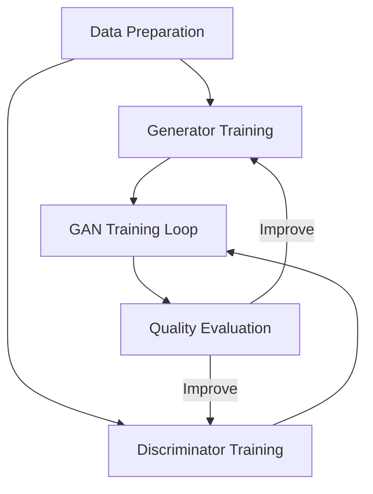

## System Architecture
### Component Diagram

```mermaid
graph TD
    A[Data Preparation] --> B[Generator Training]
    A --> C[Discriminator Training]
    B --> D[GAN Training Loop]
    C --> D
    D --> E[Quality Evaluation]
    E -->|Improve| B
    E -->|Improve| C
```

### Key Improvements:
- Added feedback loop for model improvement
- Clearer separation of training phases
- Explicit quality evaluation step